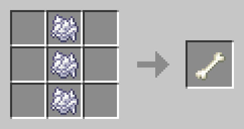

# no_violence_pack

A minecraft datapack that allows users to win (get to the end) and experience all the game has to offer on peaceful mode. The user doesn't have to kill any animals, fish for anything, or fight any mobs, but will still have the means to obtain all useful resources that exist in the game.

Recipe images and json template from [destruc7ion's crafting site](https://crafting.thedestruc7ion.ca)

### NOT INCLUDED IN RECIPES:

-  heads (used only for decoration, obtained in non-peaceful mode by killing monsters, as some mob types have a rare chance of dropping a head when killed.)
-  music discs (used for in-game background music, obtained in non-peaceful mode by raiding chests in dungeons or killing monsters that have a rare chance of dropping them when killed.)
-  other resources as overlooked

### NORMALLY DROPPED BY ANIMALS AT TIME OF DEATH

-  bone (fish)
   -  3 bone meal stacked on top of each other. Any position.
   -  
-  feather (chickens, parrots)
-  glow ink sac (glow ink squids)
-  ink sac (squids)
-  leather (cows, mooshrooms, horses, donkeys, mules, llamas, hoglins)
-  rabbit foot (rabbits)
-  rabbit hide (rabbits)

### MEATS/FISH

-  raw chicken
-  raw cod
-  raw porkchop
-  pufferfish
-  raw rabbit
-  raw salmon
-  tropical fish

### NORMALLY DROPPED BY MONSTERS AT TIME OF DEATH

-  blaze rod (blazes)
-  ender pearl (endermen)
-  ghast tear (ghasts)
-  gunpowder (creepers, ghasts, & witches; trading)
-  nether star (wither)
-  prismarine crystals (guardians & elder guardians)
-  prismarine shards (guardians & elder guardians)
-  rotten flesh (zombies, zoglins, & zombified piglins; fishing)
-  shulker shell (shulker)
-  slime ball (slimes; 1/700 chance of obtaining from a panda sneeze)
-  spider eye (spiders & witches)
-  sponge (elder guardians; can generate in ocean monuments)
-  string (spiders & cats; breaking a cobweb)
-  totem of undying (evokers)
-  trident (rare drop from drowned)
