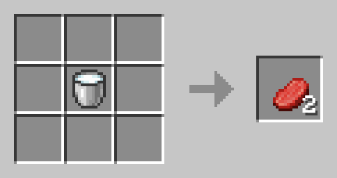

# No violence pack

A minecraft datapack that allows users to win (get to the end) and experience all the game has to offer on peaceful mode. The user doesn't have to kill any animals, fish for anything, or fight any mobs, but will still have the means to obtain all useful resources that exist in the game.

Recipe images and json template from [destruc7ion's crafting site.](https://crafting.thedestruc7ion.ca)

Resources listed as

-  resource (usual source)
   -  tool used
   -  description of recipe
   -  image of recipe

## NOT INCLUDED IN RECIPES:

-  heads (used only for decoration, obtained in non-peaceful mode by killing monsters, as some mob types have a rare chance of dropping a head when killed.)
-  music discs (used for in-game background music, obtained in non-peaceful mode by raiding chests in dungeons or killing monsters that have a rare chance of dropping them when killed.)
-  other resources as overlooked

## NORMALLY DROPPED BY ANIMALS AT TIME OF DEATH

-  bone (fish)
   -  crafting table
   -  3 bone meal stacked on top of each other. Any position.
   -  
-  feather (chickens, parrots)
   -  crafting table
   -  2 paper stacked on top of each other with 1 stick below. Any position.
   -  
-  glow ink sac (glow ink squids)
   -  crafting table
   -  1 soul lantern surrounded by 8 inc sacs. Returns 8 glow ink sacs.
   -  
-  ink sac (squids)
   -  crafting table
   -  5 sea grass placed in an 'X' shape.
   -  
-  leather (cows, mooshrooms, horses, donkeys, mules, llamas, hoglins)
   -  furnace
   -  1 rotten flesh.
   -  
-  rabbit foot (rabbits)
   -  crafting table
   -  3 raw rabbits stacked on top of each other. Any position.
   -  
-  rabbit hide (rabbits)
   -  crafting table
   -  1 raw rabbit. Any position.
   -  

## MEATS/FISH

-  raw beef
   -  crafting table
   -  1 bucket of milk. Any position. Returns 2 beef.
   -  
-  raw chicken
   -  crafting table
   -  1 egg. Any position.
   -  
-  cod
   -  crafting table
   -  3 sea grass placed horizontally at the top of the crafting box.
   -  
-  raw porkchop
   -  crafting table
   -  1 pink dye to the left of 1 beef. Any position.
   -  
-  pufferfish
   -  crafting table
   -  3 sea grass placed horizontally at the bottom of the crafting box.
   -  
-  raw rabbit
   -  crafting table
   -  1 light gray dye to the left of 1 chicken. Any position.
   -  
-  raw salmon
   -  crafting table
   -  3 sea grass placed vertically to the left of the crafting box.
   -  
-  tropical fish
   -  crafting table
   -  3 seagrass placed horizontally in the middle of the crafting box.
   -  

## NORMALLY DROPPED BY MONSTERS AT TIME OF DEATH

-  blaze rod (blazes)
-  ender pearl (endermen)
-  ghast tear (ghasts)
-  gunpowder (creepers, ghasts, & witches; trading)
-  nether star (wither)
-  prismarine crystals (guardians & elder guardians)
-  prismarine shards (guardians & elder guardians)
-  rotten flesh (zombies, zoglins, & zombified piglins; fishing)
-  shulker shell (shulker)
-  slime ball (slimes; 1/700 chance of obtaining from a panda sneeze)
-  spider eye (spiders & witches)
-  sponge (elder guardians; can generate in ocean monuments)
-  string (spiders & cats; breaking a cobweb)
-  totem of undying (evokers)
-  trident (rare drop from drowned)

## OTHER

-  nautilus shell (fishing; drowned on death; trading)
-  froglights (after a frog eats a tiny magma cube. Color depends on variant of frog that ate the cube.)
-  saddle (fishing; specific mobs on death; trading)
